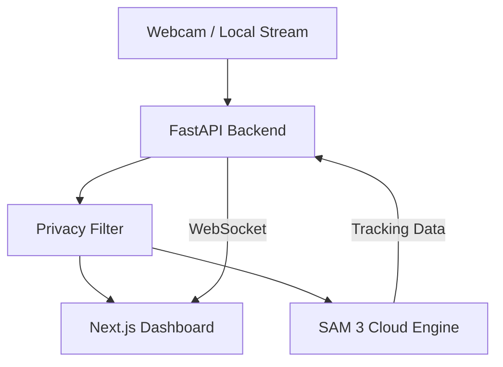

# 🛡️ ChronoGuard AI

[](https://www.python.org/downloads/)
[](https://nextjs.org/)
[](https://fastapi.tiangolo.com/)
[](https://github.com/facebookresearch/sam3)
[](https://opensource.org/licenses/MIT)

**ChronoGuard AI** is a state-of-the-art, distributed surveillance system that leverages Meta's **Segment Anything Model 3 (SAM 3)** for real-time object tracking, geofencing, and temporal state analysis. Designed for edge-to-cloud efficiency, it combines local privacy-preserving processing with high-performance remote AI inference.

---

## 🚀 Key Features

- **🎯 Precision Tracking**: Click any object in the live stream to initiate real-time tracking using SAM 3's memory-based video predictor.
- **🌐 Distributed Architecture**: Local FastAPI backend handles video capture and privacy, while a remote Google Colab GPU node handles heavy AI inference.
- **🔒 Zero-Trust Privacy**: Local privacy filters ensure sensitive data is processed or blurred before reaching external endpoints.
- **🚧 Dynamic Geofencing**: Define custom monitoring zones (polygons) via the interactive dashboard to trigger alerts when objects enter or leave specific areas.
- **🧠 Temporal Persistence**: An intelligent engine monitors tracking quality and can trigger "backtracking" logic if an object is lost or obscured.
- **📊 Real-Time Dashboard**: A premium Next.js dashboard featuring WebSockets for sub-100ms latency video streaming and alert management.

---

## 🏗️ System Architecture



---

## 🛠️ Installation & Setup

### 1. Remote AI Engine (Google Colab)
Since SAM 3 requires significant GPU memory (VRAM), we host the inference engine on Google Colab.

> [!IMPORTANT]
> **SAM 3 requires HuggingFace access approval before use.**
> 1. Visit [huggingface.co/facebook/sam3](https://huggingface.co/facebook/sam3) and accept the license.
> 2. Generate a HuggingFace access token at [huggingface.co/settings/tokens](https://huggingface.co/settings/tokens).
> 3. Once approved, add `HF_TOKEN` to Colab Secrets (Left sidebar → 🔑 Secrets).

1.  Open a new [Google Colab](https://colab.research.google.com/) notebook.
2.  Copy the contents of `colab_endpoint.py` into a cell.
3.  Add your `NGROK_TOKEN` **and** `HF_TOKEN` to Colab Secrets (Left sidebar → 🔑 Secrets).
4.  Run the cell. Copy the **Public ngrok URL** generated (e.g., `https://xxxx.ngrok-free.app`).

### 2. Local Backend (FastAPI)
1.  **Clone the Repository**:
    ```bash
    git clone https://github.com/Anshsurana123/ChronoGuard.git
    cd ChronoGuard
    ```
2.  **Install Dependencies**:
    ```bash
    pip install -r requirements.txt
    ```
3.  **Configure Environment**:
    Set your Colab URL in `main.py` or as an environment variable:
    ```bash
    export SAM_ENDPOINT="https://your-ngrok-url.ngrok-free.app"
    ```
4.  **Run the Server**:
    ```bash
    python main.py
    ```

### 3. Frontend Dashboard (Next.js)
1.  **Navigate to Dashboard**:
    ```bash
    cd dashboard
    ```
2.  **Install Dependencies**:
    ```bash
    npm install
    ```
3.  **Start the UI**:
    ```bash
    npm run dev
    ```
4.  Open [http://localhost:3000](http://localhost:3000) in your browser.

---

## 🎮 How to Use

1.  **Start the Stream**: Ensure both the Backend and Dashboard are running. You should see your webcam feed on the dashboard.
2.  **Select Target**: Simply click on any person or object in the video feed. ChronoGuard will send the frame to SAM 3 and begin tracking.
3.  **Draw Geofence**: Use the "Set Geofence" tool in the UI to draw a polygon around sensitive areas.
4.  **Monitor Alerts**: If a tracked object breaches a geofence or leaves the screen, an alert will be logged in the side panel with a timestamped snapshot.

---

## 🛠️ Tech Stack

- **Backend**: FastAPI, OpenCV, Uvicorn, WebSockets.
- **Frontend**: Next.js 14, TailwindCSS, Lucide Icons, Framer Motion.
- **AI/ML**: Meta SAM 3 (Segment Anything 3), PyTorch.
- **Infrastructure**: Ngrok (Tunneling), Google Colab (Remote GPU), HuggingFace Hub.

---

## 📝 License

This project is licensed under the MIT License - see the [LICENSE](LICENSE) file for details.

---

<p align="center">
  Built with ❤️ by <b>Ansh Surana</b>
</p>
